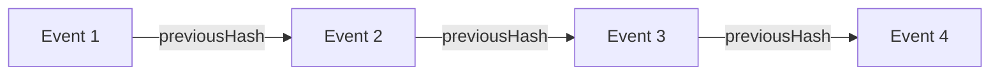

# Arquitectura de Cadena de Custodia (Audit Chain)

Esta documentación describe la implementación técnica del sistema de auditoría inmutable basado en SHA-256 para el cumplimiento de la LOPDP Ecuador.

## 1. Principio Fundamental

Cada evento de auditoría en el sistema actúa como un "bloque" en una cadena lineal. La integridad de la cadena se garantiza mediante el enlazado criptográfico: cada evento contiene el hash de su propio contenido (`payloadHash`) y el hash del evento anterior (`previousHash`).



Cualquier alteración en el contenido de un evento invalidará su `payloadHash`. Cualquier eliminación o reordenamiento romperá el enlace `previousHash` con el siguiente evento.

## 2. Estructura del Evento

La entidad `AuditChain` en la base de datos almacena:

| Campo | Tipo | Descripción |
|-------|------|-------------|
| `id` | UUID | Identificador único del evento |
| `tenantId` | UUID | Organización a la que pertenece |
| `eventType` | String | Tipo de acción (e.g., CONSENT_GRANTED) |
| `timestamp` | DateTime | Fecha y hora exacta (UTC) |
| `payload` | JSON | Datos específicos del evento |
| `payloadHash` | String | SHA-256 del payload ordenado |
| `previousHash` | String | payloadHash del evento anterior |
| `metadata` | JSON | Contexto (IP, User Agent, Actor) |

## 3. Algoritmo de Hashing

### 3.1 Hashing de Payload
Para garantizar consistencia, el payload JSON se normaliza antes de hashear:
1.  Las claves del objeto se ordenan alfabéticamente.
2.  Se convierte a string JSON.
3.  Se aplica SHA-256.

```typescript
function calculatePayloadHash(payload: any): string {
  const jsonString = JSON.stringify(payload, Object.keys(payload).sort());
  return `SHA256:${crypto.createHash('sha256').update(jsonString).digest('hex')}`;
}
```

### 3.2 Enlazado de Bloques
Al crear un nuevo evento:
1.  Se busca el último evento registrado para el `tenantId`.
2.  Se toma su `payloadHash` como `previousHash` del nuevo evento.
3.  Si es el primer evento, `previousHash` es `null`.

## 4. Verificación de Integridad

El sistema proporciona un endpoint `/api/audit/verify` que realiza dos comprobaciones:

1.  **Integridad de Contenido:** Recalcula el `payloadHash` de cada evento y lo compara con el almacenado.
2.  **Integridad de Cadena:** Verifica que `event[i].previousHash === event[i-1].payloadHash`.

Si cualquiera de estas comprobaciones falla, la cadena se marca como **COMPROMETIDA**.

## 5. Exportación de Evidencias

El sistema permite exportar la cadena completa en formato CSV o JSON.
-   El reporte incluye una columna `Is Verified` calculada en tiempo real durante la generación.
-   Los archivos exportados sirven como evidencia forense digital.

## 6. Consideraciones de Seguridad

-   **Inmutabilidad:** La base de datos debe configurarse con permisos de "Solo Insertar" para la tabla de auditoría (idealmente).
-   **Firmas Digitales:** Para mayor seguridad (futuro), cada hash podría firmarse digitalmente con una clave privada del servidor.
-   **Almacenamiento Externo:** Hashes periódicos (checkpoints) podrían publicarse en una blockchain pública o servicio de notariado digital para evitar manipulación total de la DB.
